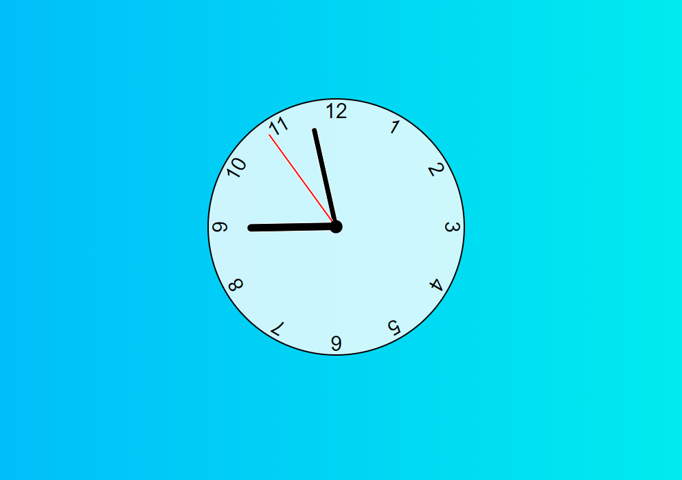

# Clock App

This clock app provides a simple yet elegant way to visualize the current time. With its sleek design and smooth animations, it brings the timeless charm of traditional clocks to the digital world.

### Roadmap

This project is ongoing. New features and enhancements will be added from time to time to improve the functionality and user experience of the clock app. Some planned features include:

- Support for different time zones
- Alarm functionality
- Additional customization options
- Stay tuned for updates!

### Features

- Real-time Updates: The clock updates in real-time, accurately reflecting the current hour, minute, and second.

- Intuitive Interface: The intuitive interface makes it easy to read and understand the time at a glance.

- Customizable Styling: Customize the appearance of the clock to suit your preferences by modifying the CSS styles.

- Responsive Design: The app is responsive and adjusts seamlessly to different screen sizes, ensuring a consistent user experience across devices.

#### Developed Using:

## Getting Started

To run the Clock App on your local machine, please follow the steps below:

1. Clone the repository to your local machine one of the following:
   HTTPS: <pre><code>git clone https://github.com/jvang0620/Clock</code></pre>
   SSH: <pre><code>git clone git@github.com:jvang0620/Clock</code></pre>

 

2. Add extension "Live Server" if you havn't:

    

 

3. Next, right-click anywhere in the HTML file and select "Open with Live Server", and the app will display on your local machine.

 

You're all set. Happy coding!!!:)
